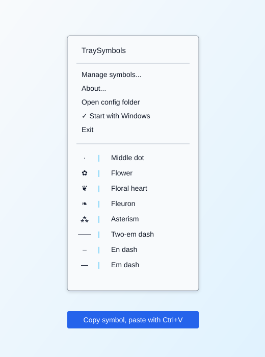

# TraySymbols Native

TraySymbols Native is a small standalone Windows tray tool for inserting typographic symbols without AutoHotkey.

This v0.2 native build intentionally focuses on tray-based insertion. It does not install global hotstrings or keyboard hooks, so it keeps a much smaller behavioral footprint than the old AutoHotkey version.



## Features

- Native Win32 tray icon and popup menu
- Built-in symbols: `—`, `–`, `⸺`, `⁂`, `❧`, `❦`, `✿`, `·`
- Unicode clipboard writes via `CF_UNICODETEXT`
- Custom symbols managed inside the app
- German UI on German Windows, English UI otherwise
- About dialog with version, architecture, and config path
- Open config folder from the tray menu
- Optional current-user autostart via Startup-folder shortcut
- Portable/no-install friendly

## Download

Use the portable ZIPs from GitHub Releases or the latest GitHub Actions build artifacts.

Each portable ZIP contains:

```text
TraySymbols.exe
README.md
LICENSE
```

## Build Locally

Requirements:

- CMake
- Visual Studio Build Tools with MSVC
- Windows SDK

Configure and build x64:

```powershell
cmake -S . -B build -A x64
cmake --build build --config Release
```

The executable is created at:

```text
build\Release\TraySymbols.exe
```

GitHub Actions also builds x64 and x86 portable ZIP artifacts on push, pull request, manual dispatch, and release tags.

## Usage

Start `TraySymbols.exe`. A tray icon appears in the Windows notification area.

- Left-click or right-click the icon to open the menu.
- Click a symbol to copy it.
- Paste with `Ctrl + V` wherever you want to insert it.
- Use `Manage symbols...` to add, edit, delete, and reorder your own symbols.
- Use `About...` to see version, GitHub URL, architecture, config mode, and config path.
- Use `Open config folder` to open the active config folder.
- Toggle `Start with Windows` to create or remove the current-user Startup shortcut.
- Use `Exit` to quit.

Menu entries are shown symbol-first, for example:

```text
⸺ | Two-em dash
```

## Custom Symbols

Custom entries have two fields:

- `Label`: menu label shown in the tray menu
- `Symbol/Text`: the text copied to the clipboard

If `Label` is empty, TraySymbols uses the text as the label.

The config format is an INI file:

```ini
[Symbols]
Count=2
Label1=Copyright
Text1=©
Label2=My separator
Text2=※
```

TraySymbols first tries to store the config next to the EXE:

```text
TraySymbols.ini
```

If that folder is not writable, it falls back to:

```text
%APPDATA%\TraySymbols\TraySymbols.ini
```

## Autostart

For no-install autostart:

Use the tray menu item `Start with Windows`.

TraySymbols creates a current-user Startup-folder shortcut at:

```text
%APPDATA%\Microsoft\Windows\Start Menu\Programs\Startup\TraySymbols.lnk
```

The app does not use the registry for autostart.

## Notes

- This is not the old AutoHotkey build.
- Global hotstrings such as `;em -> —` are intentionally deferred to a possible separate full build.
- Auto-paste was intentionally removed because Windows focus/input rules made it unreliable. TraySymbols copies cleanly; use `Ctrl + V` to paste.
- Windows XP support is not part of this first native build and can be evaluated separately.

## Release Roadmap

Included release infrastructure:

- GitHub Actions build for x64/x86 portable ZIP artifacts and draft tag releases.
- Optional Inno Setup script in `installer/TraySymbols.iss`.
- Release notes and signing/XP notes in `docs/release.md`.

Still planned after the portable v0.2 release:

- Signed release binaries when a code-signing certificate is available.
- Separate XP compatibility investigation/build track.

## License

MIT.
